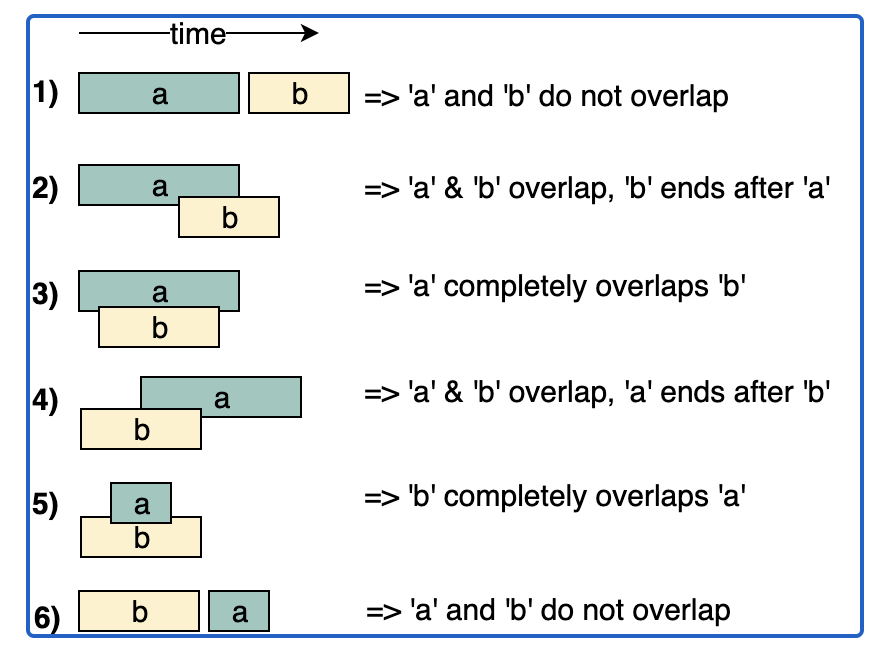

# Merge Interval

## 介绍

* 该模式用于处理区间问题。

```java
//定义区间：
class Interval {
    int start;
    int end;
};
```

* 给定两个区间a、b, 两者之间的关系有如下六种情况：


### 合并区间

区间a、b, 满足a.start <= b.start

```java
if(b.start > a.end){
    //b.start > a.end 不存在交集 不能合并
    //存储a, 更新start end
}else{
    //b.start <= a.end  存在交集 可以合并. 合并后区间：[a.start, max(a.end, b.end)]
    int statr = a.start;
    int end = max(a.end, b.end)
}
```

### 插入区间

* 如果两区间存在交集，合并后的区间为：[min(a.start, b.start), max(a.end, b.end)]

## 解题方法 & 代码模板

## 题目

* Merge Intervals (medium)
